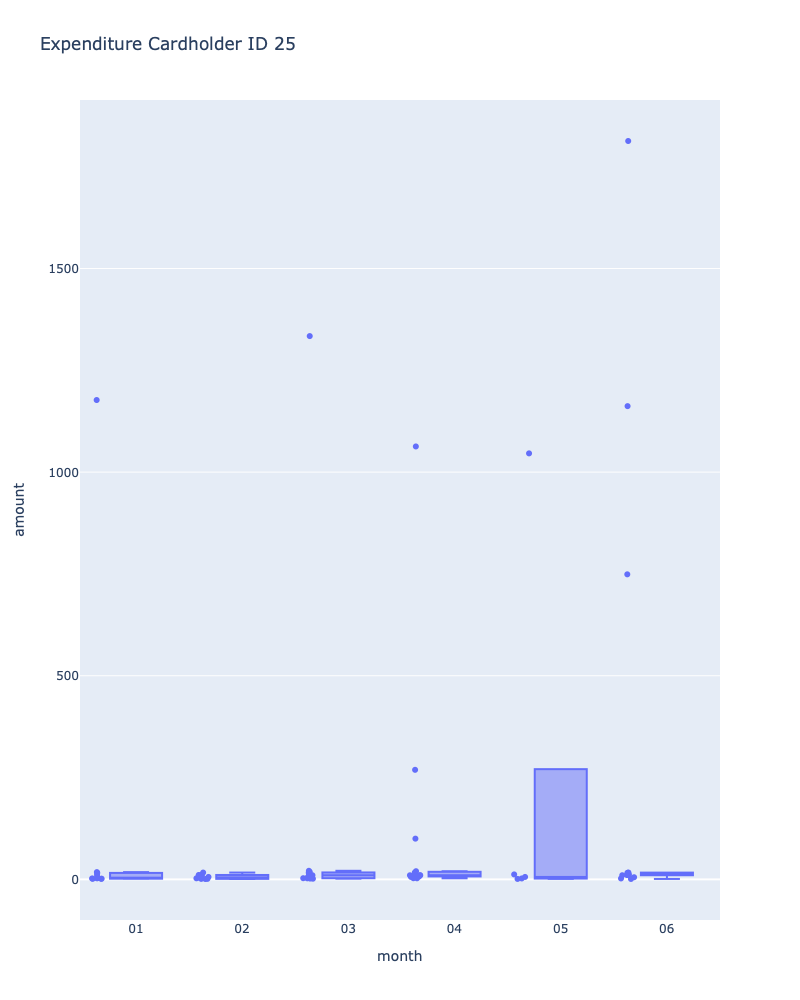

# FTbootC_Mod7_Hwwk
# by Javier Aramayo
# Assignment Unit 7 - SQL, Python, Visualization

### Data Analysis

## Part 1: 
Some fraudsters hack a credit card by making several small transactions (generally less than $2.00), which are typically ignored by cardholders.

# How can you isolate (or group) the transactions of each cardholder?
Answer: Query to group transactions by cardholders

    SELECT card_holder.id, card_holder.name, credit_card.card, transaction.amount, transaction.date
    FROM transaction
    JOIN credit_card ON credit_card.card = transaction.card
    JOIN card_holder ON card_holder.id = credit_card.cardholder_id
    ORDER BY card_holder.name;

# Count the transactions that are less than $2.00 per cardholder.
Answer: There were a total of 350 transactions less than $2.00
    SELECT COUNT(transaction.amount)
    FROM transaction
    WHERE transaction.amount < 2;

    SELECT transaction.card, COUNT(transaction.amount)
    FROM transaction
    WHERE transaction.amount < 2
    GROUP BY transaction.card
    ORDER BY COUNT(transaction.amount) DESC;

# Is there any evidence to suggest that a credit card has been hacked? Explain your rationale.
Answer: There some cards with a higher number of transactions over $2.00; however, not clearly evident

# Take your investigation a step futher by considering the time period in which potentially fraudulent transactions are made.

What are the top 100 highest transactions made between 7:00 am and 9:00 am?
Query:
SELECT *
FROM transaction AS t
WHERE date_part('hour', t.date) >= 7
AND date_part('hour', t.date) <=9
ORDER BY t.amount DESC
LIMIT 100;

 

 Do you see any anomalous transactions that could be fraudulent?

# Is there a higher number of fraudulent transactions made during this time frame versus the rest of the day?

Answer: Yes, there is no more than 11 credit cards with various transactions between 7 to 9 am; that could be fraudulent.

If you answered yes to the previous question, explain why you think there might be fraudulent transactions during this time frame.

Answer: Consumers would not normally make purchases at 7 to 9 am; unless for coffee or breakfast. The transactions queried should be compared with the merchant to further review the type of transactions

# What are the top 5 merchants prone to being hacked using small transactions?
Query: To identify the merchants within the 100 highest transactions between  and 9 am
SELECT *
FROM transaction AS t
WHERE date_part('hour', t.date) >= 7
AND date_part('hour', t.date) <=9
ORDER BY t.id_merchant DESC
LIMIT 100;

File:

## Part 2: Visualizations and Analysis

The two most important customers of the firm may have been hacked. Verify if there are any fraudulent transactions in their history. For privacy reasons, you only know that their cardholder IDs are 2 and 18.

Using hvPlot, create a line plot representing the time series of transactions over the course of the year for each cardholder separately.

Next, to better compare their patterns, create a single line plot that contains both card holders' trend data.

# What difference do you observe between the consumption patterns? Does the difference suggest a fraudulent transaction? Explain your rationale.

The CEO of the biggest customer of the firm suspects that someone has used her corporate credit card without authorization in the first quarter of 2018 to pay quite expensive restaurant bills. Again, for privacy reasons, you know only that the cardholder ID in question is 25.

Using Plotly Express, create a box plot, representing the expenditure data from January 2018 to June 2018 for cardholder ID 25.

# Are there any outliers for cardholder ID 25? How many outliers are there per month?
yes, there are outliers with transactions for high amounts.

# Do you notice any anomalies? Describe your observations and conclusions.
Also, there were a large number of transactions for a higher than usual transaction amounts in the month of June.

